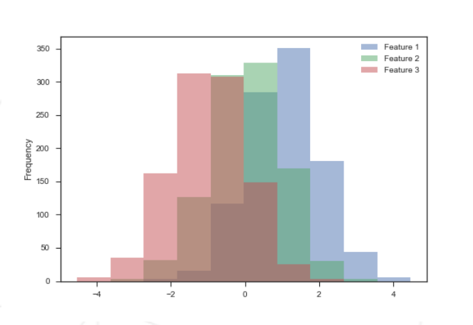
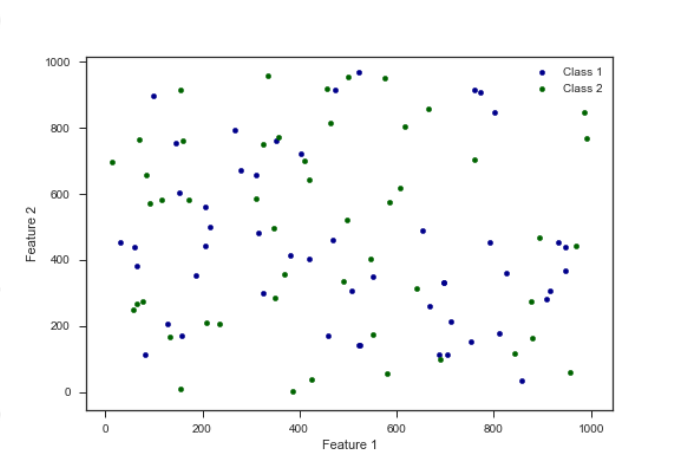
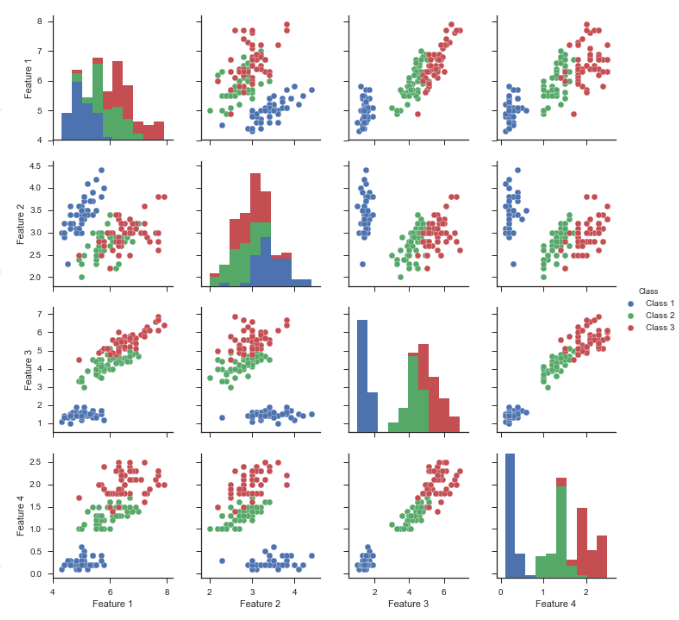
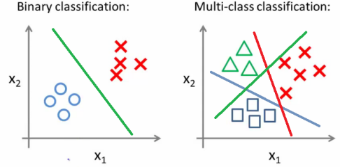

# DSLR
Project to learn Logistic Regression, a classification Machine Learning Algorithm.
# Sources:
- [Geeks for Geeks explaining what is Logistic Regression](https://www.geeksforgeeks.org/machine-learning/understanding-logistic-regression/)
- [IBM Article about Logistic Regression and it's difference with Linear Regression](https://www.ibm.com/think/topics/logistic-regression)
- [Youtube video which explain the Logistic Regression](https://www.youtube.com/watch?v=3bvM3NyMiE0)
- [Youtube video which explain multinomial Logistic Regression](https://www.youtube.com/watch?v=KbK_Nb9OS70)
- [Medium article explaining what's a one-vs-all logistic regression](https://medium.com/data-science/multi-class-classification-one-vs-all-one-vs-one-94daed32a87b)
- [Youtube video on how to implement logistic regression from scratch with every explanation](https://www.youtube.com/watch?v=S6iuhdYsGC8)
- [GeeksForGeeks article about multiclass Logistic Regression](https://www.geeksforgeeks.org/artificial-intelligence/multiclass-logistic-regression/)
- [Wikipedia of Multinomial Logistic Regression](https://en.wikipedia.org/wiki/Multinomial_logistic_regression)
- [Wikipedia of the SoftMax Function](https://en.wikipedia.org/wiki/Softmax_function)

# Usage:
To use our DSLR, you need to have **python** installed.
Execute this in your terminal:
```bash
> source ./setup.sh
```
It will create a **virtual environment** for **python**, import it requirements and source it to your current shell.

You can then execute our scripts.

# Subject:
## 1- Data Analysis
The goal is to **recreate** the `describe` function.

You need to recreate some maths function like:
- **mean**
- **var** (Variance)
- **std** (Standard Deviation)
- **min** (Minimal)
- **max** (Maximal)
- **25% / 50% / 75%** (percentile)

You then need to **print** it to clearly see what's each of those **information** for each **features**.

Ex for our DataSet:

```txt
          Arithmancy    Astronomy    Herbology  Defense Against the Dark Arts   Divination  Muggle Studies  Ancient Runes  History of Magic  Transfiguration      Potions  Care of Magical Creatures       Charms       Flying
count    1566.000000  1568.000000  1567.000000                    1569.000000  1561.000000     1565.000000    1565.000000       1557.000000      1566.000000  1570.000000                1560.000000  1600.000000  1600.000000
mean    49634.570243    39.797131     1.141020                      -0.387863     3.153910     -224.589915     495.747970          2.963095      1030.096946     5.950373                  -0.053427  -243.374409    21.958012
std     16679.806036   520.298268     5.219682                       5.212794     4.155301      486.344840     106.285165          4.425775        44.125116     3.147854                   0.971457     8.783640    97.631602
min    -24370.000000  -966.740546   -10.295663                     -10.162119    -8.727000    -1086.496835     283.869609         -8.858993       906.627320    -4.697484                  -3.313676  -261.048920  -181.470000
25%     38511.500000  -489.551387    -4.308182                      -5.259095     3.099000     -577.580096     397.511047          2.218653      1026.209993     3.646785                  -0.671606  -250.652600   -41.870000
50%     49013.500000   260.289446     3.469012                      -2.589342     4.624000     -419.164294     463.918305          4.378176      1045.506996     5.874837                  -0.044811  -244.867765    -2.515000
75%     60811.250000   524.771949     5.419183                       4.904680     5.667000      254.994857     597.492230          5.825242      1058.436410     8.248173                   0.589919  -232.552305    50.560000
max    104956.000000  1016.211940    11.612895                       9.667405    10.032000     1092.388611     745.396220         11.889713      1098.958201    13.536762                   3.056546  -225.428140   279.070000
```

## 2- Data Visualization
The goal is to make three scripts to **show the data** with **different plots**.
We need a:
- **Histogram**
- **Scatter Plot**
- **Pair Plot**
### Histogram:

### Scatter Plot

### Pair Plot


## 3- Logistic Regression

The goal is now to create two scripts, one to train a **Logistic Regression** model, and another one to **predict** in which group go the new data.



# Logistic Regression
## Concept / Uses

The **Logistic Regression** is a simple **binary classification algorythm**.
It mean that it serve to know if a point is either in one group or another (True or False, Yes or No, in group A or not in group A).

**Binary classification** is good, but you can also use the **logistic regression** to see if a point is in one of many group.
To do that, you need to train multiple **binary logistic regression** for each group (Is in group or not) and combine them with the **SoftMax** algorithm.

It use the **gradient descent** on a **sigmoid function** to find the closest curve for the classification.


On this exemple, the **sigmoid curve** tell us that the more **saving amount** you have **better are your chance** to get a **Loan Approved**.
Better the **curve fit the point**, **better your prediction** are. That's why we use the **gradient descent**: to find the **most fit curve**.